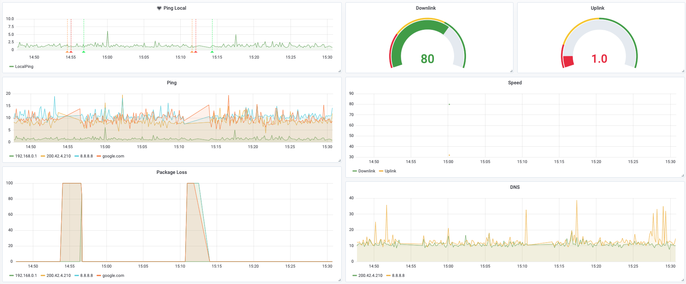
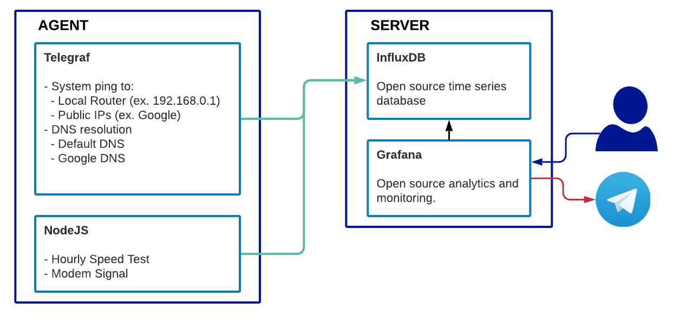

# ISP Monitoring

This is a guide on how to monitor the quality of your ISP using InfluxDB and Telegraf.

Have you ever asked yourselve if internet is working properlly 🤔? Or without internet and waiting for it to come alive once again 🙇‍♂️? This setup will give you information of the quality and reliability of your ISP 😎. Oh, and did I mention Alerts 🚨when ISP is down or back online?



## How it works

The goal is to setup an local Agent, running in your home 🏡, and make it report all that data to be monitored.

The default configuration of the Agent will ping every 10 seconds to `google.com` and `8.8.8.8`. It will also measure DNS resolution to `google.com` domain using `8.8.8.8` and `1.1.1.1` DNS Servers.



## Provision your ISP Monitor

There are three different alternatives to deploy this stack

|                    | Requirements                                            | Metrics | Notifications | Ease of Install | Remote Monitoring |
| ------------------ | ------------------------------------------------------- | ------- | ------------- | --------------- | ----------------- |
| InfluxDB Free Tier | Raspberry Pi or similar                                 | ✅       | ✅             | Easy            | ✅                 |
| Standalone         | Raspberry Pi or similar                                 | ✅       | ❌             | Medium          | ❌ Unless exposed  |
| Self Hosting       | Raspberry Pi or similar + Cloud Hosting, VPS or similar | ✅       | ✅             | Difficult       | ✅                 |

## Using InfluxDB Free Tier


Using Influxdata Free Tier as the managed cloud solution that combines InfluxDB + Grafana. And Telegraf in Raspberry Pi at your home.

### Step 1 - Create Influxdb Account

1. Create a [Influxdb Cloud account](https://cloud2.influxdata.com/signup)
2. Select Provider & Region (Maybe the one with a region near your location)
3. Enter Company Name
4. Click Next
5. Choose Free Plan

### Step 2 - Import Template

1. Open your Influxdb Account
2. On the sidebar. Sertings > Templates
3. Paste URL of Template
   https://raw.githubusercontent.com/sbehrends/isp-monitor/main/isp-monitor-influxdata-template.yml
4. Click Lookup Tempalte
5. Click Install Template

### Step 3 - Update Webhook

1. Click on Alerts
2. Modify "Notification Endpoint" > "Webhook" with your own URL

### Step 4 - Run Telegraf Agent

For reporting ISP Status we now require an Agent or Client that will run in your local network and report ISP status to InfluxDB.

This agent can be running on a Raspberry Pi, NAS or similar, and requires Telegraf to be installed.

1. Get Telegraf configuration
2. Click on _Load Data_ > _Telegraf_
3. Click on _Setup Instructions_ under _Network Monitor_
4. Click on _Create New Token_ and use it for later configuration
5. Use command from _Telegraf Setup Instructions_ step 3

Under _Telegraf Setup Instructions_, you will find several alterantives to install Telegraf Agent. Keep in mind that `$INFLUX_HOST; $INFLUX_TOKEN; $INFLUX_ORG` are enviroment variables required by the Telegraf configuration provided.

- INFLUX_HOST: Is the URL of influxdata in your region. You can grab it from the URL in the browser
- INFLUX_TOKEN: Token generated in previous step
- INFLUX_ORG: Visible on top-left. By default is your email.

#### Run with Docker

```
docker run -d --name=isp-monitor \
--restart=always \
-e INFLUX_TOKEN=REPLACE_TOKEN_FROM_STEP_ABOVE \
-e INFLUX_HOST=https://REPLACE_YOUR_REGION.cloud2.influxdata.com/ \
-e INFLUX_ORG=REPLACE_YOUR_ORG \
telegraf \
telegraf --config https://PASTE_URL_FROM_STEP_ABOVE
```


```
# docker-compose.yml
version: "2"
services:
  telegraf:
    image: telegraf
    restart: always
    command: telegraf --config https://PASTE_URL_FROM_STEP_ABOVE
    environment: 
      INFLUX_TOKEN: REPLACE_TOKEN_FROM_STEP_ABOVE
      INFLUX_HOST: https://REPLACE_YOUR_REGION.cloud2.influxdata.com/
      INFLUX_ORG: REPLACE_YOUR_ORG
```

## [WIP] Standalone

Deploy Telegraf, InfluxDB and Granfana all in the same host, for example all in a Raspberry Pi running at your home.

Follow [this repo](https://github.com/germancorbetta/isp-monitor) as reference of this setup.

## [WIP] Self Hosting

Deploy InfluxDB and Grafana on a Virtual Private Server, or similar cloud hosting. And Telegraf in Raspberry Pi at your home.

This is my personal current setup. I have not documented it all yet, but includes InfluxDB, Grafana and Let's Encrypt certs running in docker in a VPS. Besides Telegraf Agent there is a NodeJS service to measure Internet Speed (using speedtest-net) and Modem Signal Level (Only available for ISP Fibertel, Argentina).

Reference script is available in `self-hosted` folder.

## Additional Tooling

I recommend [Balena](https://www.balena.io/) to orchestrate and deploy Raspberry Pi's with Telegraf agent. In my current setup I have 4 Raspberry Pi's managed by Balena reporting to my Self Hosted Influx + Grafana.

